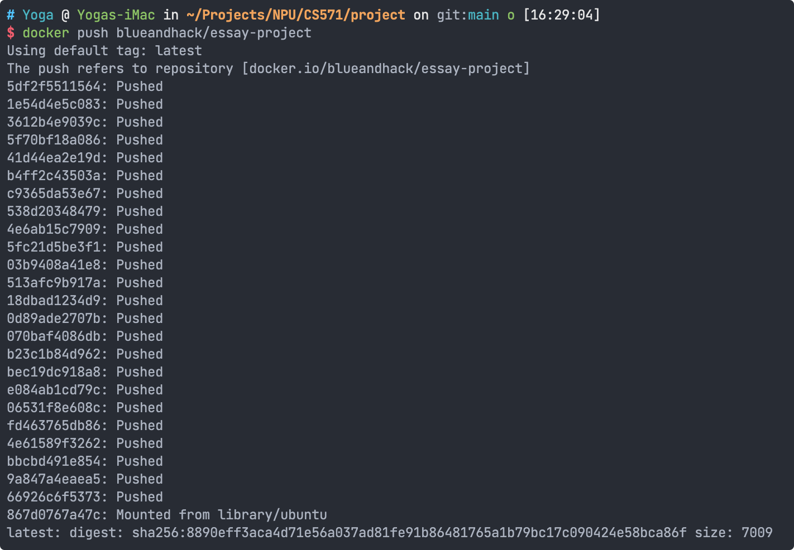

# Signature Project: Automated Essay Scoring System

Github: https://github.com/blueandhack/Automated-Essay-Scoring-System-With-K8S

# Step 1. Wrap application to a docker image

1. Build docker image and push

Create `Dockerfile`

```docker
FROM ubuntu:20.04
SHELL ["/bin/bash", "-c"]
ENV TZ=America/Los_Angeles
RUN ln -snf /usr/share/zoneinfo/$TZ /etc/localtime && echo $TZ > /etc/timezone
RUN apt-get update -y
RUN apt-get upgrade -y
RUN apt-get install build-essential -y
RUN apt-get install libxml-parser-perl wget git pip unzip pkg-config libpng-dev libfreetype6-dev freetype2-demos python3 python3-pip python3-tk -y
RUN mkdir -p /home/project/
WORKDIR /home/project/
RUN mkdir -p /tmp/
RUN wget --load-cookies /tmp/cookies.txt \
    "https://docs.google.com/uc?export=download&confirm=$(wget \
    --quiet --savecookies /tmp/cookies.txt --keep-session-cookies \
    --no-check-certificate 'https://drive.google.com/file/d/1RxfZOYyNvzvCf37_vABfJMkohAsEZKtH/' \
    -O- | sed -rn 's/.confirm=([0-9A-Za-z_]+)./\1\n/p')&id=1RxfZOYyNvzvCf37_vABfJMkohAsEZKtH" \
    -O rough.zip && rm -rf /tmp/cookies.txt
RUN wget https://s3.amazonaws.com/models.huggingface.co/bert/bert-large-uncased.tar.gz
RUN unzip rough.zip
RUN cpan install XML::Parser::PerlSAX
RUN cpan install XML::RegExp
RUN cpan install XML::DOM
WORKDIR /home/project/RELEASE-1.5.5
RUN ./runROUGE-test.pl
WORKDIR /home/project/
RUN git clone https://github.com/bheinzerling/pyrouge.git
WORKDIR /home/project/pyrouge
RUN pip install -e .
WORKDIR /home/project/
RUN git clone https://github.com/Quan25/flask-summary.git
RUN cd /home/project/
RUN pip3 install torch torchvision torchaudio --extra-index-url https://download.pytorch.org/whl/cpu
RUN pip3 install flask pandas sklearn nltk gensim==3.8.3 pytorch-pretrained-bert matplotlib==3.0.1
RUN echo $'import nltk\nnltk.download("punkt")' > punktDownload.py
RUN python3 punktDownload.py
WORKDIR /home/project/flask-summary
RUN echo $'#!/bin/bash\nsed -i "s/\/home\/quan\/Downloads\/bert-large-uncased/\/home\/project\/bert-large-uncased.tar.gz/g" summarizer/BertParent.py' > replacePath.sh
RUN chmod +x replacePath.sh
RUN ./replacePath.sh
EXPOSE 5000
CMD ["python3", "app.py"]
```

```bash
docker build -t blueandhack/essay-project .
docker push blueandhack/essay-project
```




# Step 2. K8S configuration and deploy

1. Create cluster with high performance virtual machine (c2-standard-4)

```bash
gcloud container clusters create essay-project --num-nodes=1 --machine-type=c2-standard-4 --region=us-west1-a
```


2. Create deployment, service and ingress yaml

Create `essay-project-deployment.yaml`

```yaml
apiVersion: apps/v1
kind: Deployment
metadata:
  name: essay-project-deployment
spec:
  selector:
    matchLabels:
      app: essay-project-deployment
  replicas: 1
  template:
    metadata:
      labels:
        app: essay-project-deployment
    spec:
      containers:
      - name: essay-project-deployment
        image: blueandhack/essay-project
        ports:
        - containerPort: 5000
```

Create `essay-project-service.yaml`

```yaml
apiVersion: v1
kind: Service
metadata:
  name: essay-project-service
spec:
  selector:
    app: essay-project-deployment
  ports:
  - protocol: TCP
    port: 5000
    targetPort: 5000
```

Create `essay-project-service-ingress.yaml`

```yaml
apiVersion: networking.k8s.io/v1
kind: Ingress
metadata:
  name: essay-project-service-ingress
  annotations:
    nginx.ingress.kubernetes.io/rewrite-target: /$2
spec:
  rules:
    - host: essay.blueandhack.com
      http:
        paths:
          - path: /
            pathType: Prefix
            backend:
              service:
                name: essay-project-service
                port:
                  number: 5000
```

3. Create resources by yaml files

```bash
kubectl create -f essay-project-deployment.yaml
kubectl create -f essay-project-service.yaml
kubectl create -f essay-project-service-ingress.yaml
```


4. Check status and ingress external address IP 

```bash
kubectl get pods
kubectl get svc
kubectl get ingress
```


Copy ingress address IP

# Step 3. DNS and Testing

1. DNS setting

Go to Cloudflare to setting up DNS, for the project, I want to using the subdomain “essay”, so set A type record with Name “essay” and IPv4 “34.117.197.229” 


Try to ping the domain to make sure DNS is set correctly


2. Open browser and type domain [http://essay.blueandhack.com](http://essay.blueandhack.com/) (After finishing the project, I shut down the cluster)


